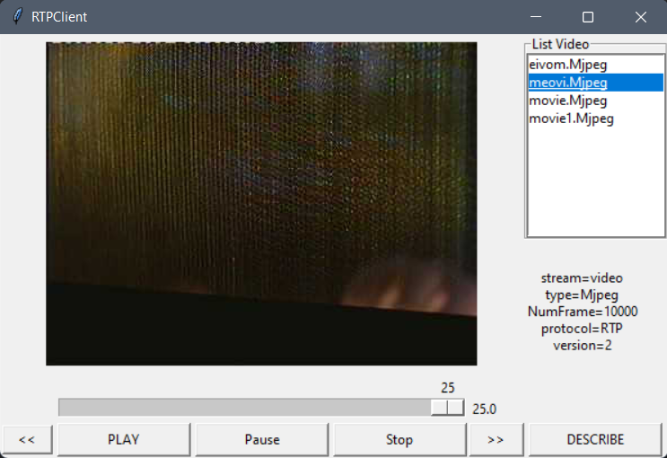

# Video Streaming with RTSP and RTP

## Files
```
.
├── Nomal                   # Normal requirements files
│   ├── Client.py           
│   ├── ServerWorker.py
│   ├── VideoStream.py
│   ├── RtpPacket
├── Extend                  # Extend requirements files
│   ├── Client3Button.py
│   ├── ClientExtend.py
│   ├── ServerWorkerExtend.py
├── templates               # HTML file
│   ├── index.html            
├── static                  # Js/css file
│   ├── index.js              
├── videos                  # Video files
│   └── ...
├── ClientLauncher.py       # Client launcher (both normal and extend)
├── Server.py               # Server launcher (both normal and extend)
├── ServerWeb.py            # Server web launcher
├── ServerWorkerWeb.py
└── ...   
```
## UI


👉👉 Double click name video to switch video
## Usage
### `Normal mode`
- Run server
```
python Server.py [server_port]
```
- Run client
```
python ClientLauncher.py [server addr] [server_port] [client_port] [videoName]
```
### `3 button mode`
- Run client 3 button
```
python ClientLauncher.py [server addr] [server_port] [client_port] [videoName] 1
```
### `Extend mode`
- Run server extend mode
```
python Server.py [server_port] 1
```
- Run client extend
```
python ClientLauncher.py [server addr] [server_addr] [client_port] [videoName] 2
```
### `Web mode`
- Run web server
```
python serverWeb.py
```
- Access web client in [http://127.0.0.1:5000](http://127.0.0.1:5000)
